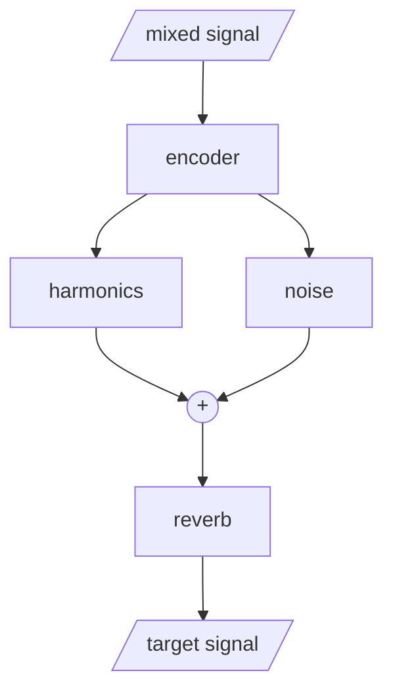

# DDSP Vocal Separation

```mermaid
flowchart TD
    A[/mixed signal/] --> B[encoder]
    B --> C[harmonics]
    B --> D[noise]
    C --> E((+))
    D --> E
    E --> F[reverb]
    F --> G[/target signal/]
```
